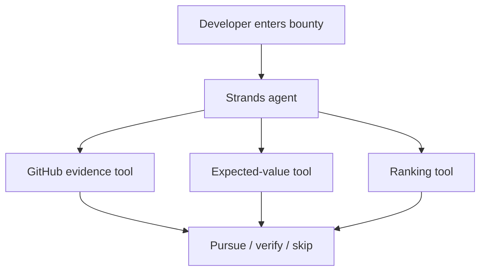

# Opportunity Guardian — Agents for Humans submission

Opportunity Guardian is a professional agent that prevents developers from wasting hours on stale, crowded, unfunded, or impossible open-source bounties. It combines live primary evidence with a personal opportunity-cost calculation and returns one accountable decision: pursue, verify first, or skip.

## Why it belongs in Agents for Humans

A bounty hunter repeatedly checks the same facts across GitHub, bounty boards, sponsor terms, and competing claims. Missing one fact can turn a $100 promise into five hours of unpaid work. The agent handles that repetitive due diligence while leaving contribution and payout decisions to the human.

## Strands implementation

The Strands agent gets three bounded tools:

- `verify_github_bounty` fetches the live GitHub issue and repository and applies inspectable risk rules.
- `calculate_expected_value` converts reward, acceptance odds, effort, and the user's hourly floor into expected profit.
- `rank_verified_opportunities` compares already-checked candidates without inventing missing evidence.

The system prompt forces primary checks before a recommendation and forbids representing an advertisement as guaranteed income.



## Run

```bash
python -m venv .venv
source .venv/bin/activate
pip install -r hackathons/agents_for_humans/requirements.txt
streamlit run hackathons/agents_for_humans/app.py
```

The default Strands model provider uses Amazon Bedrock and therefore needs valid AWS credentials and model access. No paid cloud resource is created by this repository.

## Submission checklist

- Public MIT-licensed repository: complete.
- Non-trivial Strands agent and three custom tools: complete.
- Tested core decision engine: complete.
- Live demo: needs deployment after AWS credentials are configured.
- Architecture diagram: complete.
- Devpost description and five-minute-or-shorter video: not yet submitted.
- Optional `builder.aws` posts: not yet published.

Official competition: https://agentsforhumans.devpost.com/

